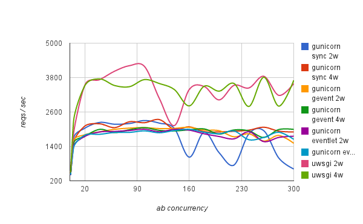

# Docker + Gunicorn + Nginx 部署 Flask 应用


## Introduction

- **Gunicorn**
>Gunicorn是一个unix上被广泛使用的高性能的Python WSGI UNIX HTTP Server

与uwsgi的性能比较:



- **Nginx**
>Nginx (engine x) 是一个高性能的HTTP和反向代理web服务器，同时也提供了IMAP/POP3/SMTP服务

## Note

- 因为Alpine镜像的小巧，所以使用python:3.6-alpine作为基础镜像，但是难免也会在后期遇到莫名其妙的错误，则需要慎重考虑是否一定需要使用Alpine镜像，而替换为python:3.6作为基础镜像

## Q&A

1. 自定义容器启动脚本报错: standard_init_linux.go:178: exec user process caused "no such file or directory"

> 原因是镜像的entrypoint设置的启动脚本格式是dos，在linux系统上用vi修改成unix格式即可

```
vi filename
:set ff  # 回车后看到当前文件的fileformat格式
:set ff=unix # 回车后输入:wq保存文件，重新build镜像即可
```


2. docker运行nginx为什么要使用 daemon off

> Docker 容器启动时，默认会把容器内部第一个进程，也就是pid=1的程序，作为docker容器是否正在运行的依据，如果 docker 容器pid=1的进程挂了，那么docker容器便会直接退出。
